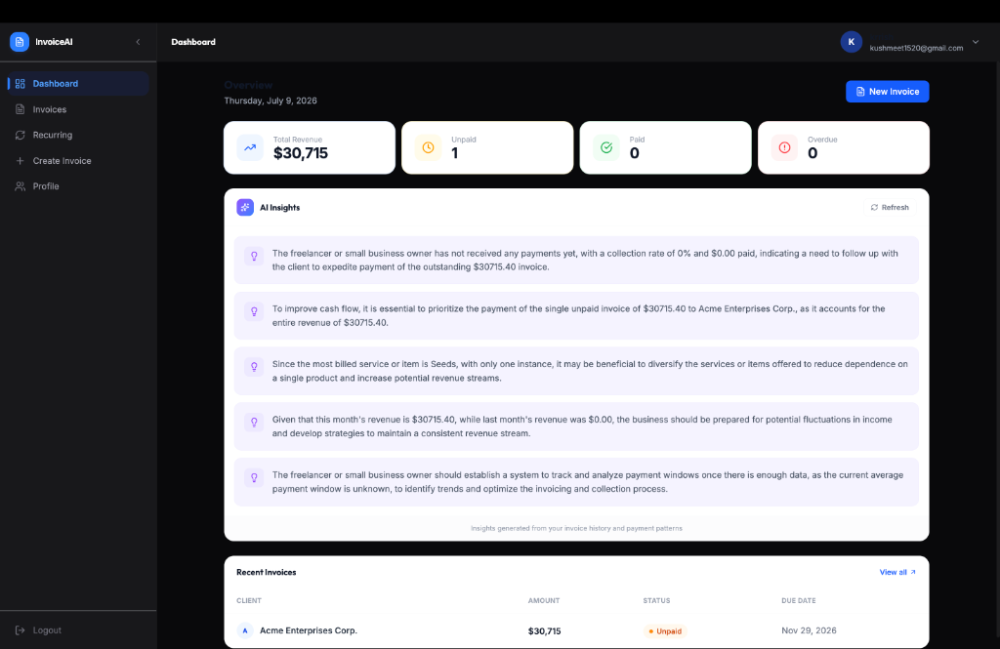

# AI-Powered Invoice Generator
 
A full-stack invoice management platform that uses AI to turn plain-English descriptions into structured, professional invoices — plus recurring billing, AI-generated payment reminders, and a smart dashboard with data-driven insights.
 
**Live demo:** [ai-powered-invoice-generator-jx5c.vercel.app](https://ai-powered-invoice-generator-jx5c.vercel.app)
 
---

Screenshots
[Home Page]


[DashBoard]



[Create Invoice]


[Profile Page]


[ALL Invoices]


## Features
 
- **AI Invoice Generation** — describe an invoice in plain text ("Invoice for John Smith at Acme Corp for 10 hours of web design at $150/hour, due in 30 days") and have it parsed into a structured invoice automatically.
- **AI Payment Reminders** — generate professional, personalized reminder emails for overdue or upcoming payments in one click.
- **AI Dashboard Insights** — data-driven, plain-English insights about revenue, collection rate, overdue invoices, and top clients, computed from real invoice data.
- **Recurring Invoices** — set up monthly/yearly recurring billing per client, with pause, resume, and cancel controls, powered by a scheduled cron job.
- **PDF Export** — download any invoice as a polished PDF.
- **Authentication** — secure JWT-based auth with protected routes.
- **Responsive UI** — built with Tailwind CSS and Framer Motion for smooth, modern interactions.
---
 
## Tech Stack
 
**Frontend**
- React + Vite
- Tailwind CSS
- Framer Motion
- Axios
**Backend**
- Node.js + Express
- MongoDB + Mongoose
- JWT authentication
- node-cron (recurring invoice scheduling)
**AI**
- [Groq](https://groq.com/) — `llama-3.3-70b-versatile`, with JSON-mode structured output for reliable parsing
**Deployment**
- Frontend: [Vercel](https://vercel.com/)
- Backend: [Render](https://render.com/)
- Database: [MongoDB Atlas](https://www.mongodb.com/atlas)
---
 
## Architecture
 
```
┌─────────────────┐        ┌──────────────────┐        ┌─────────────────┐
│  React Frontend │  HTTP  │  Express Backend  │  ODM   │  MongoDB Atlas  │
│   (Vercel)      │ ─────► │    (Render)       │ ─────► │                 │
└─────────────────┘        └────────┬──────────┘        └─────────────────┘
                                     │
                                     ▼
                            ┌─────────────────┐
                            │   Groq LLM API   │
                            │ (JSON-mode calls)│
                            └─────────────────┘
```
 
---
 
## Getting Started
 
### Prerequisites
- Node.js 18+
- A MongoDB Atlas connection string
- A [Groq API key](https://console.groq.com/keys)
### 1. Clone the repo
```bash
git clone https://github.com/AvinashGhai/AI-Powered-Invoice-Generator.git
cd AI-Powered-Invoice-Generator
```
 
### 2. Backend setup
```bash
cd backend
npm install
```
 
Create a `.env` file inside `backend/`:
```env
PORT=8000
MONGO_URI=your_mongodb_connection_string
JWT_SECRET=your_jwt_secret
GROQ_API_KEY=your_groq_api_key
```
 
Run the backend:
```bash
nodemon server.js
```
 
### 3. Frontend setup
```bash
cd frontend
npm install
npm run dev
```
 
The app should now be running locally, with the frontend on Vite's default port and the backend on `PORT` from your `.env`.
 
---
 
## API Overview
 
| Method | Endpoint | Description | Auth |
|---|---|---|---|
| POST | `/api/auth/register` | Register a new user | — |
| POST | `/api/auth/login` | Log in | — |
| GET/PUT | `/api/auth/me` | Get / update profile | ✅ |
| GET/POST | `/api/invoices` | List / create invoices | ✅ |
| GET/PUT/DELETE | `/api/invoices/:id` | Get / update / delete an invoice | ✅ |
| POST | `/api/ai/parse-text` | Parse plain text into a structured invoice | ✅ |
| POST | `/api/ai/generate-reminder` | Generate an AI payment reminder email | ✅ |
| GET | `/api/ai/dashboard-summary` | Get AI-generated dashboard insights | ✅ |
| POST | `/api/ai/parse-recurring` | Parse plain text into a recurring schedule | ✅ |
| GET/POST | `/api/recurring` | List / create recurring invoices | ✅ |
| PUT | `/api/recurring/:id/pause` \| `/resume` \| `/cancel` | Manage a recurring invoice's state | ✅ |
| DELETE | `/api/recurring/:id` | Delete a recurring invoice | ✅ |
 
---
 
## Project Structure
 
```
AI-Powered-Invoice-Generator/
├── backend/
│   ├── config/          # DB connection
│   ├── controllers/      # Route logic (auth, invoices, AI, recurring)
│   ├── middleware/        # JWT auth middleware
│   ├── models/            # Mongoose schemas
│   ├── routes/             # Express routers
│   └── server.js
└── frontend/
    ├── src/
    │   ├── components/  # Reusable UI components
    │   ├── pages/         # Route-level pages
    │   └── utils/          # Axios instance, API paths, helpers
    └── vercel.json          # SPA routing rewrite for Vercel
```
 
---
 
## Roadmap
 
- [ ] Payment-risk scoring for overdue invoices
- [ ] CORS restricted to production domain
- [ ] httpOnly cookie-based auth (instead of localStorage JWT)
- [ ] Natural-language invoice search/filtering
---
 
 
## Author
 
**Avinash Ghai**
[GitHub](https://github.com/AvinashGhai)

