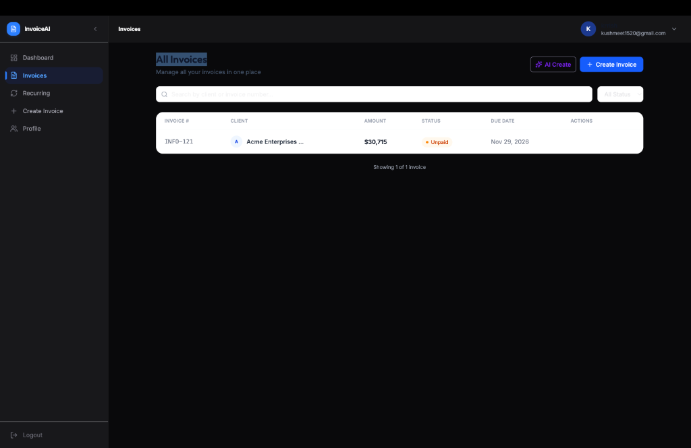
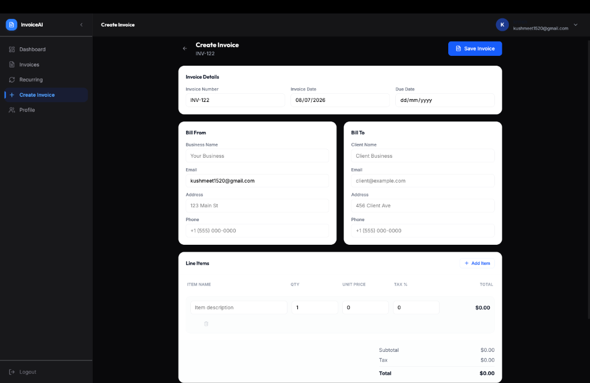
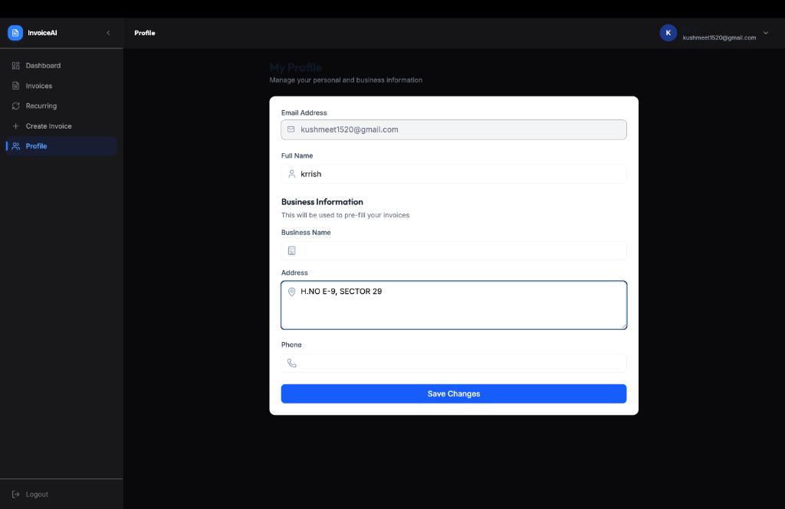

# AI-Powered Invoice Generator
 
A full-stack invoice management platform that uses AI to turn plain-English descriptions into structured, professional invoices — plus recurring billing, AI-generated payment reminders, and a smart dashboard with data-driven insights.
 
**Live demo:** [ai-invoice-generator-nine-beryl.vercel.app](https://ai-invoice-generator-nine-beryl.vercel.app)
 
---

## Overview

[Dashboard]


[All Invoices]


[Create Invoice]


[Profile Page]



## Features
 
- **AI Invoice Generation** — describe an invoice in plain text ("Invoice for John Smith at Acme Corp for 10 hours of web design at $150/hour, due in 30 days") and have it parsed into a structured invoice automatically.
- **AI Payment Reminders** — generate professional, personalized reminder emails for overdue or upcoming payments in one click.
- **AI Dashboard Insights** — data-driven, plain-English insights about revenue, collection rate, overdue invoices, and top clients, computed from real invoice data.
- **Recurring Invoices** — set up monthly/yearly recurring billing per client, with pause, resume, and cancel controls, powered by a scheduled cron job.
- **PDF Export** — download any invoice as a polished PDF.
- **Authentication** — secure JWT-based auth with protected routes.
- **Responsive UI** — built with Tailwind CSS and Framer Motion for smooth, modern interactions.
---
 
## Tech Stack
 
**Frontend**
- React + Vite
- Tailwind CSS
- Framer Motion
- Axios
**Backend**
- Node.js + Express
- MongoDB + Mongoose
- JWT authentication
- node-cron (recurring invoice scheduling)
**AI**
- [Groq](https://groq.com/) — `llama-3.3-70b-versatile`, with JSON-mode structured output for reliable parsing
**Deployment**
- Frontend: [Vercel](https://vercel.com/)
- Backend: [Render](https://render.com/)
- Database: [MongoDB Atlas](https://www.mongodb.com/atlas)
---
 
## Architecture
 
```
┌─────────────────┐        ┌──────────────────┐        ┌─────────────────┐
│  React Frontend │  HTTP  │  Express Backend  │  ODM   │  MongoDB Atlas  │
│   (Vercel)      │ ─────► │    (Render)       │ ─────► │                 │
└─────────────────┘        └────────┬──────────┘        └─────────────────┘
                                     │
                                     ▼
                            ┌─────────────────┐
                            │   Groq LLM API   │
                            │ (JSON-mode calls)│
                            └─────────────────┘
```
 
---
 
 
 
## Project Structure
 
```
AI-Powered-Invoice-Generator/
├── backend/
│   ├── config/          # DB connection
│   ├── controllers/      # Route logic (auth, invoices, AI, recurring)
│   ├── middleware/        # JWT auth middleware
│   ├── models/            # Mongoose schemas
│   ├── routes/             # Express routers
│   └── server.js
└── frontend/
    ├── src/
    │   ├── components/  # Reusable UI components
    │   ├── pages/         # Route-level pages
    │   └── utils/          # Axios instance, API paths, helpers
    └── vercel.json          # SPA routing rewrite for Vercel
```
 
---
 


